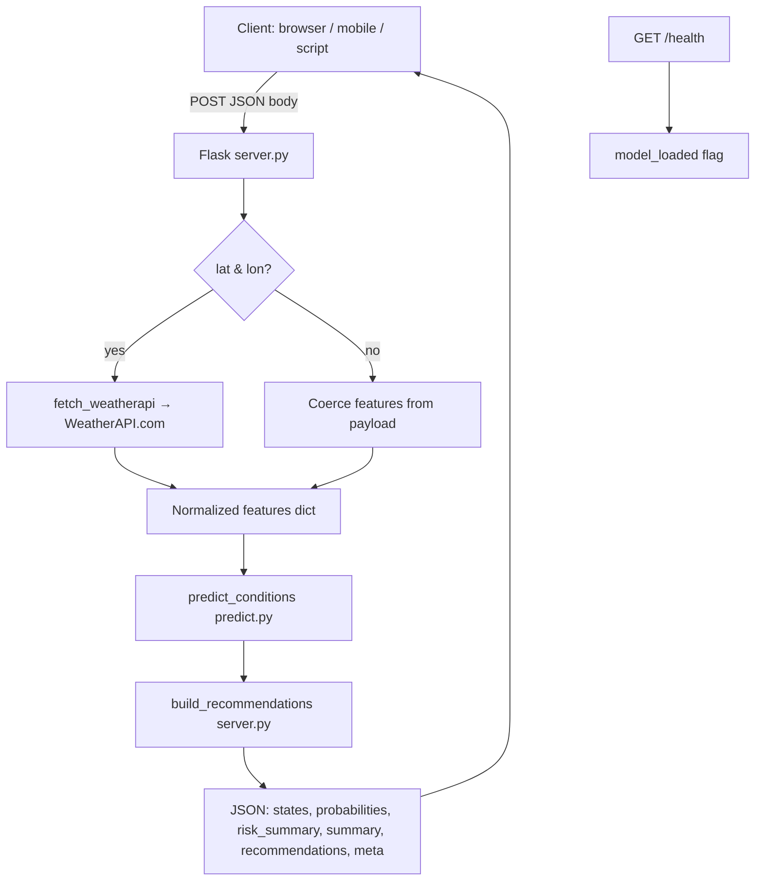

# Weather Assistant API — Complete Documentation

**Single handbook** for architecture, machine learning, REST API, operations, deployment, and troubleshooting. *(Consolidates former `API_DOCS.md`, `BACKEND_FRONTEND_RESPONSE_REPORT.md`, `DEPLOY.md`, `Explanation.md`, `KULLANIM_REHBERI.md`, `run.txt`, `SISTEM_AKISI.md`.)*

---

## Table of contents

1. [Overview](#1-overview)
2. [Architecture & request flow](#2-architecture--request-flow)
3. [Machine learning pipeline](#3-machine-learning-pipeline)
4. [Inference, risk scoring & recommendations](#4-inference-risk-scoring--recommendations)
5. [REST API reference](#5-rest-api-reference)
6. [Client integration examples](#6-client-integration-examples)
7. [Operations (local setup & training)](#7-operations-local-setup--training)
8. [Deployment](#8-deployment)
9. [Troubleshooting](#9-troubleshooting)

---

## 1. Overview

**Weather Assistant API** combines:

| Layer | Role |
|--------|------|
| **Training data** | Merged Kaggle-style CSVs → unified features + derived multi-label targets (`build_dataset.py`). |
| **Live data** | [WeatherAPI](https://www.weatherapi.com/) `current.json` when the client sends `lat`/`lon`. |
| **Model** | Scikit-learn **multi-label** classifier (candidates compared in `train.py`; bundle saved as `models/weather_model.pkl`). |
| **Post-processing** | Threshold checks on raw features, **composite outdoor risk score**, English **summary** and **recommendation** cards (`server.py`). |

Endpoints: **`GET /health`**, **`POST /predict`** (optional query **`?explain=true`**).

### Official client application

**[weather-assistant-app](https://github.com/CE-zevkirlioglu/weather-assistant-app)** (Expo + React Native) is the companion UI for this API: it calls `POST /predict` with GPS or a saved city, includes manual feature testing and `?explain=true` for `explanation.per_label`, and uses a configurable base URL (see `services/api.ts`, defaulting to the hosted backend).

---

## 2. Architecture & request flow



**Typical coordinate flow**

1. Client sends `POST /predict` with `lat`, `lon`.
2. Backend calls WeatherAPI, parses JSON via `weather_api.from_current_json`, validates required fields.
3. **`predict_conditions`** loads `weather_model.pkl`, runs `predict` / `predict_proba`, emits `states`, `probabilities`, `confidences`, rain-focused `label` / `proba`.
4. **`build_recommendations`** merges model flags with safety rules (e.g. temp ≤ 15 °C → cold), computes **risk_score** / **risk_level**, builds English **summary** and **recommendations** (plus optional **`general_risk`**).
5. Response returns **flattened** model fields at the **root** (no nested `prediction` object).

---

## 3. Machine learning pipeline

### 3.1 Features and labels

Definitions live in `prepare_data.py` / `build_dataset.py`.

**Input columns**

| Feature | Meaning |
|---------|---------|
| `temp` | Temperature (°C) |
| `humidity` | Relative humidity (%) |
| `wind_speed` | Wind speed (m/s) after normalization |
| `pressure` | Pressure (hPa) |
| `clouds` | Cloud cover (%) |
| `uv_index` | UV index |

**Output labels** (multi-label binary)

| Label | Meaning |
|-------|---------|
| `label_rain` | Rain conditions |
| `label_hot` | Hot |
| `label_cold` | Cold |
| `label_uv_high` | High UV |
| `label_windy` | Strong wind |

The model predicts **five independent Bernoulli-style outputs** via `MultiOutputClassifier` — not mutually exclusive classes.

### 3.2 Data sourcing

`build_dataset.py` loads and merges sources (paths depend on files present under `data/kaggle/`), aligns schema, fills/caps values, then **`_add_labels`** applies rule-based thresholds on the historical rows (e.g. cold if `temp <= 15`, windy if `wind_speed >= 10`, etc., as coded there).

Processed output defaults to **`data/processed/weather_training.csv`** (see script constants).

### 3.3 Training (`train.py`)

- Loads CSV via `prepare_data.load_dataset`.
- **Train/test split** (~80/20), stratified on **`label_rain`** (`random_state=42`).
- **Candidates** (see `build_candidates()`): typically **scaled Logistic Regression** vs **scaled RandomForest**, each wrapped in **`MultiOutputClassifier`**.
- Metrics per label: precision, recall, F1; **macro F1** selects the best bundle.
- Serialized bundle includes `model`, `feature_columns`, `label_columns`, `scores`, etc., written to **`models/weather_model.pkl`**.

### 3.4 Inference (`predict.py`)

`predict_conditions(features, model_bundle=..., include_explanation=False)`:

1. Builds one-row `DataFrame` in training column order (missing **`uv_index`** defaults to `0.0`).
2. `predict` → boolean vector per label → **`states`**.
3. If **`predict_proba`** exists → **`probabilities`** clipped to \[0,1\].
4. **`confidences`** bucket: high / medium / low from probability distance from 0.5 (see `_confidence`).
5. **`label`**: `"Rain"` / `"NoRain"` from **`label_rain`** state; **`proba`**: rain probability.
6. If **`include_explanation`** → attaches **`explanation.per_label`** (each label’s probability, confidence, predicted flag).

---

## 4. Inference, risk scoring & recommendations

Implemented in **`build_recommendations`** (`server.py`).

**Safety post-processing**

- If `temp ≤ 15` → force **cold** flag (even if model missed).
- If `uv_index ≥ 5` → force **uv_high** flag.

**Risk factors** (codes used in **`risk_summary.risk_factors`**): `rain`, `cold`, `heat`, `uv`, `wind`.

**Composite risk**

- Combines rain probability, wind-derived risk (m/s → km/h bands), UV bands, temperature comfort bands with weights; bonuses when multiple flags fire; hybrid **`max(linear_aggregate, severity_max)`** so one extreme channel is not diluted.
- **`risk_level`**: `low` / `moderate` / `high` / `very_high` from score thresholds.

**“Pleasant” logic**

- Conceptually “favorable” only when **no condition flags** *and* **`risk_level == low`** (if risk spikes from components alone, pleasant is cleared).

**Outputs**

- **`summary`**: English sentence from risk tier + factor list (`format_factors_en`).
- **`recommendations`**: templates for `hot`, `cold`, `uv_high`, `windy`, `rain`, `pleasant`; optional **`general_risk`** row for elevated tiers.

---

## 5. REST API reference

### Base URLs

| Environment | Example |
|-------------|---------|
| Local | `http://localhost:8000` |
| Hosted | Your deploy URL (e.g. `https://weather-assistant-api.onrender.com`) |

---

### `GET /health`

**Response 200**

```json
{
  "status": "ok",
  "model_loaded": true
}
```

| Field | Type | Description |
|-------|------|-------------|
| `status` | string | `"ok"` when the process responds |
| `model_loaded` | boolean | `true` if `weather_model.pkl` loaded at startup |

---

### `POST /predict`

**Headers:** `Content-Type: application/json`

#### Request bodies

**A — Coordinates (live WeatherAPI)**

```json
{ "lat": 41.0082, "lon": 28.9784 }
```

**B — Wrapped manual features**

```json
{
  "features": {
    "temp": 25,
    "humidity": 60,
    "wind_speed": 5,
    "pressure": 1013,
    "clouds": 30,
    "uv_index": 6
  }
}
```

**C — Flat features** — same numeric keys at the root as in **B**.

**Coordinate validation:** `lat ∈ [-90,90]`, `lon ∈ [-180,180]`.

#### Query parameter

| Param | Example | Effect |
|-------|---------|--------|
| `explain` | `/predict?explain=true` | Adds **`explanation`** object when `predict_conditions(..., include_explanation=True)` |

Truthy values: `true`, `1`, `yes` (case-insensitive).

#### Successful response shape (200)

Model output is **not** nested under `prediction`. Important root fields:

| Field | Type | Description |
|-------|------|-------------|
| `success` | boolean | `true` |
| `features` | object | Values passed to the model |
| `states` | object | Booleans per `label_*` |
| `probabilities` | object | Per-label probabilities \[0,1\] when available |
| `confidences` | object | `high` / `medium` / `low` / `unknown` |
| `label` | string | `"Rain"` or `"NoRain"` (rain summary) |
| `proba` | number \| null | Rain probability |
| `summary` | string | English risk/context summary |
| `risk_summary` | object | `risk_score`, `risk_level`, `risk_factors` |
| `recommendations` | array | `{ id, message, active }` cards; ids include `general_risk` when applicable |
| `meta` | object | `source`, coordinates, WeatherAPI location fields when applicable |
| `explanation` | optional | Present only with `?explain=true`: `per_label[]` |

**`risk_summary`**

| Field | Description |
|-------|-------------|
| `risk_score` | Float in \[0,1\] |
| `risk_level` | `low` \| `moderate` \| `high` \| `very_high` |
| `risk_factors` | Codes: `rain`, `cold`, `heat`, `uv`, `wind` |

**`explanation.per_label` entries**

| Keys | Description |
|------|-------------|
| `label`, `probability`, `confidence`, `predicted` | Per multi-label output |

#### Example success JSON (abbreviated)

```json
{
  "success": true,
  "features": {
    "temp": 17.3,
    "humidity": 88.0,
    "wind_speed": 1.61,
    "pressure": 1019.0,
    "clouds": 0.0,
    "uv_index": 0.0
  },
  "states": {
    "label_rain": false,
    "label_hot": false,
    "label_cold": false,
    "label_uv_high": false,
    "label_windy": false
  },
  "probabilities": {
    "label_rain": 0.061,
    "label_hot": 0.04,
    "label_cold": 0.003,
    "label_uv_high": 0.0,
    "label_windy": 0.052
  },
  "confidences": {
    "label_rain": "high",
    "label_hot": "high",
    "label_cold": "high",
    "label_uv_high": "high",
    "label_windy": "high"
  },
  "label": "NoRain",
  "proba": 0.061,
  "summary": "Outdoor risk is low. Conditions appear generally favorable.",
  "risk_summary": {
    "risk_score": 0.12,
    "risk_level": "low",
    "risk_factors": []
  },
  "recommendations": [
    { "id": "hot", "message": "It's very hot. Wear light, breathable clothing and drink plenty of water.", "active": false },
    { "id": "pleasant", "message": "Conditions look generally favorable. Good for spending time outside.", "active": true }
  ],
  "meta": {
    "source": "weatherapi",
    "lat": 41.0082,
    "lon": 28.9784,
    "location_name": "Istanbul",
    "location_country": "Turkey",
    "local_time": "2026-04-19 14:30",
    "condition": "Clear"
  }
}
```

#### Error responses

| HTTP | Typical body |
|------|----------------|
| 400 | `{ "error": "..." }` — invalid/missing body or features |
| 403 | `{ "error": "Unauthorized WeatherAPI request." }` |
| 500 | `{ "error": "Model not loaded..." }` or `{ "error": "Internal server error", "detail": "..." }` |
| 502 | `{ "error": "Failed to reach WeatherAPI service", "detail": "..." }` |
| 500 | `{ "error": "Prediction failed", "detail": "..." }` |

**`OPTIONS /predict`:** `{ "status": "ok" }` — CORS preflight.

#### Client checklist

1. Read **`response.states`**, not `response.prediction.states`.
2. Use **`risk_summary`** for gauges; **`summary`** for headline text.
3. Use **`POST /predict?explain=true`** when you need **`explanation.per_label`**.

#### Rate limiting & CORS

- No built-in API rate limit; respect **WeatherAPI** quotas and hosting provider limits.
- **CORS** allows all origins (`flask-cors`) for mobile/web clients.

---

## 6. Client integration examples

### JavaScript / React Native

```javascript
const API_BASE = 'https://your-service.onrender.com';

async function predictFromLocation(lat, lon, explain = false) {
  const url = `${API_BASE}/predict${explain ? '?explain=true' : ''}`;
  const res = await fetch(url, {
    method: 'POST',
    headers: { 'Content-Type': 'application/json' },
    body: JSON.stringify({ lat, lon }),
  });
  if (!res.ok) {
    const err = await res.json().catch(() => ({}));
    throw new Error(err.error || `HTTP ${res.status}`);
  }
  return res.json();
}

// Usage
const data = await predictFromLocation(41.0082, 28.9784);
console.log(data.summary);
console.log(data.risk_summary);
const active = data.recommendations.filter((r) => r.active);
```

### Swift (iOS) — illustrative structs

Decode the **root** fields; omit `prediction`.

```swift
struct PredictResponse: Codable {
    let success: Bool
    let summary: String
    let features: [String: Double]
    let states: [String: Bool]
    let probabilities: [String: Double]?
    let confidences: [String: String]?
    let label: String
    let proba: Double?
    let risk_summary: RiskSummary?
    let recommendations: [Recommendation]
    let meta: Meta
    let explanation: ExplanationPayload?
}

struct RiskSummary: Codable {
    let risk_score: Double
    let risk_level: String
    let risk_factors: [String]
}

struct Recommendation: Codable {
    let id: String
    let message: String
    let active: Bool
}

struct Meta: Codable {
    let source: String?
    let location_name: String?
    let location_country: String?
    let lat: Double?
    let lon: Double?
}
```

### Kotlin (Android)

Use Retrofit/OkHttp with the same JSON shape; map **`risk_summary`** and optional **`explanation`** if needed.

---

## 7. Operations (local setup & training)

### Requirements

- **Python 3.11+** (see `runtime.txt`)
- **WeatherAPI** key for live `lat`/`lon` calls — get a free key at [weatherapi.com](https://www.weatherapi.com/) → [sign up](https://www.weatherapi.com/signup.aspx)
- **`PYTHONPATH`** must include **`src`** so `weather_api`, `predict`, etc. resolve

**Local credentials:** copy **`.env.example`** to **`.env`** in the repository root, set `WEATHER_API_KEY=...`. The app loads this file automatically via `python-dotenv` (see `src/server.py`). **Do not commit `.env`** (it is listed in `.gitignore`).

### Install & run (PowerShell, repo root)

```powershell
python -m venv .venv
.\.venv\Scripts\Activate.ps1
pip install -r requirements.txt

copy .env.example .env
# Edit .env: WEATHER_API_KEY=<your key from weatherapi.com>

$Env:PYTHONPATH = "$PWD\src"
python src/server.py
```

Or set the variable only in the shell: `$Env:WEATHER_API_KEY = "<key>"` (no `.env` file).

Alternatives: `python -m flask --app src.server run --host 0.0.0.0 --port 8000` · `.\start_backend.bat` (Windows).

**Health check:** open or `GET` `http://localhost:8000/health`.

### Testing

| Tool | Command / action |
|------|------------------|
| Automated | `python test_api.py` |
| Browser UI | Open `test.html`, point to your base URL |
| Quick curl | `curl.exe http://localhost:8000/health` |

### Rebuild dataset & model (optional)

From repository root:

```powershell
python src/build_dataset.py
python src/train.py --csv data/processed/weather_training.csv --out models
```

### Stop server

`Ctrl+C` in the terminal running Flask.

---

## 8. Deployment

### Render.com (reference)

1. Push repository to GitHub (or connect repo).
2. **New → Web Service**, connect repo.
3. Use **`render.yaml`** if present, or set:
   - **Build:** `pip install -r requirements.txt`
   - **Start:** `gunicorn --chdir src server:app --bind 0.0.0.0:$PORT --workers 2 --timeout 120`
4. **Environment variables**
   - **`PYTHONPATH`** = `src`
   - **`WEATHER_API_KEY`** = secret from WeatherAPI
5. Ensure **`models/weather_model.pkl`** is tracked or supplied at build.

**Cold starts:** free tiers may sleep; first request after idle can be slow.

### Other hosts

`Procfile` mirrors the gunicorn command for Heroku-style platforms.

### Required env vars (summary)

| Variable | Purpose |
|----------|---------|
| `WEATHER_API_KEY` | Required for `lat`/`lon` — from [WeatherAPI](https://www.weatherapi.com/); use `.env` locally (see `.env.example`) or the host’s secret store in production |
| `PYTHONPATH` | Usually `src` |
| `PORT` | Provided by host (Flask defaults to `8000` locally if unset) |

---

## 9. Troubleshooting

| Symptom | What to check |
|---------|----------------|
| `model_loaded: false` | `models/weather_model.pkl` exists on disk/deploy artifact; logs for load errors |
| `ModuleNotFoundError: weather_api` | `PYTHONPATH` includes `src`; restart shell after `setx` |
| `403` / WeatherAPI errors | Valid **`WEATHER_API_KEY`**; billing/plan limits |
| `502` upstream | Network/DNS to WeatherAPI; outage or timeout |
| Port already in use | Change `PORT` or stop process on `8000` (`netstat` / Task Manager) |
| Stale schema in clients | Migrate off nested **`prediction`**; use root **`states`** / **`risk_summary`** |

---

## Reference files in repo

| Path | Role |
|------|------|
| `src/server.py` | Flask routes, WeatherAPI fetch, risk & recommendations |
| `src/predict.py` | Model loading & inference |
| `src/weather_api.py` | WeatherAPI JSON normalization |
| `src/build_dataset.py` / `train.py` | Data & training |
| `render.yaml` / `Procfile` | Hosting entrypoints |
| `README.md` | Project overview & quick links |

**Related repository:** [weather-assistant-app](https://github.com/CE-zevkirlioglu/weather-assistant-app) — Expo / React Native UI that consumes this API ([GitHub](https://github.com/CE-zevkirlioglu/weather-assistant-app)).

---

*Last consolidated: aligns with `src/server.py` and `src/predict.py` behavior for multi-label output, flattened JSON, English UX copy, and composite risk scoring.*