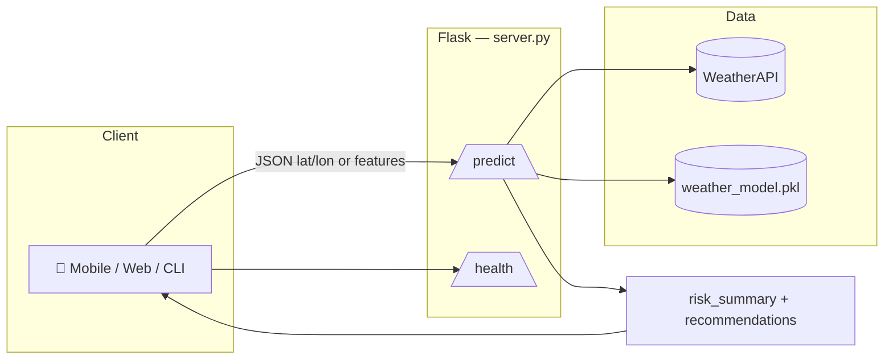

<div align="center">

# 🌤️ Weather Assistant API

### Personalized weather intelligence for mobile & web clients

[](https://www.python.org/)
[](https://flask.palletsprojects.com/)
[](https://scikit-learn.org/)
[](#-license--credits)

**Live WeatherAPI data · Multi-label ML · Composite risk scoring · English summaries & recommendations**

**Companion app:** [weather-assistant-app](https://github.com/CE-zevkirlioglu/weather-assistant-app) — Expo + React Native client for this API.

[Features](#-key-features) · [Quick start](#-quick-start) · [API](#-api-overview) · [Architecture](#-architecture) · [Deploy](#-deployment) · [Docs](#-documentation)

---

</div>

## 📖 About

**Weather Assistant API** combines **historical Kaggle-derived training data** with **real-time conditions from [WeatherAPI](https://www.weatherapi.com/)** to deliver structured predictions and **human-readable guidance** (dressing, UV, rain, wind, heat/cold).

| | |
|---|---|
| 🎯 **Goal** | Turn raw weather features into **label probabilities**, a **composite outdoor risk score**, and **actionable recommendation cards**. |
| 🧠 **Model** | Multi-output classifier (pipeline includes **RandomForest** candidate in `train.py`; bundled artifact in `models/`). |
| 📱 **Clients** | Official **[Weather Assistant app](https://github.com/CE-zevkirlioglu/weather-assistant-app)** (Expo / React Native · GPS, cities, manual test, `explain`). Any other client: **Flask + CORS**, JSON. |

---

## ✨ Key Features

| Icon | Capability |
|:---:|:---|
| 📡 | **`POST /predict` with lat/lon** — fetches current JSON from WeatherAPI, normalizes features in `weather_api.py`. |
| 🧪 | **Manual features** — send `temp`, `humidity`, `wind_speed`, `pressure`, `clouds`, `uv_index` without calling WeatherAPI. |
| 🏷️ | **Multi-label output** — `states`, `probabilities`, `confidences`, rain-focused `label` / `proba`. |
| ⚠️ | **`risk_summary`** — `risk_score` (0–1), `risk_level` (`low` → `very_high`), coded `risk_factors`. |
| 💬 | **English `summary` + `recommendations`** — templated tips; optional **`general_risk`** line for elevated risk. |
| 🔍 | **`?explain=true`** — adds `explanation.per_label` (per-label probability breakdown). See `predict.py`. |
| ❤️ | **`GET /health`** — `model_loaded` flag for uptime checks & orchestration. |

---

## 🗂️ Repository layout

```
weather-assistant-api/
├── app/
│   └── demo_gradio.py           # Optional Gradio demo (legacy / experiments)
├── data/
│   └── kaggle/                  # Raw CSVs used by build_dataset.py
├── models/
│   └── weather_model.pkl        # Trained bundle (joblib): model + column metadata
├── src/
│   ├── build_dataset.py         # Merge Kaggle sources → training CSV
│   ├── prepare_data.py          # Feature / label column definitions & loaders
│   ├── train.py                 # Train + evaluate + export bundle
│   ├── predict.py               # Inference + optional explanation payload
│   ├── weather_api.py           # WeatherAPI JSON → model features
│   └── server.py                # Flask app: /health, /predict
├── test_api.py                  # Scripted smoke tests
├── test.html                    # Browser UI for manual API checks
├── start_backend.bat            # Windows helper to launch the API
├── requirements.txt
├── runtime.txt                  # python-3.11.x (Render / local)
├── render.yaml                  # Render.com blueprint
├── Procfile                     # gunicorn entry for PaaS
├── .env.example                 # Template for WEATHER_API_KEY (copy to .env — not committed)
├── DOCUMENTATION.md             # Full handbook (API, ML, deploy, ops, troubleshooting)
└── README.md                    # ← You are here
```

---

## 🚀 Quick start

### Prerequisites

- **Python 3.11+** (see `runtime.txt`)
- **WeatherAPI.com** account and API key (free): [weatherapi.com](https://www.weatherapi.com/) → [get a key](https://www.weatherapi.com/signup.aspx). Store it in **`.env`** (from `.env.example`); do not commit real keys.

### 1 · Clone & virtualenv

```powershell
git clone <your-repo-url>
cd weather-assistant-api
python -m venv .venv
.\.venv\Scripts\Activate.ps1
pip install -r requirements.txt
```

### 2 · WeatherAPI key (required for `lat` / `lon` requests)

1. Open **[WeatherAPI.com](https://www.weatherapi.com/)** and sign up for a free API key: [signup](https://www.weatherapi.com/signup.aspx).  
2. In the project root, copy the example env file and add your key (this file is gitignored and must not be committed):

```powershell
copy .env.example .env
# Edit .env and set: WEATHER_API_KEY=your_key_here
```

Alternatively, for a single shell session only:

```powershell
$Env:WEATHER_API_KEY = "<your_key_from_weatherapi.com>"
$Env:PYTHONPATH = "$PWD\src"
```

> **Note:** `POST /predict` with only manual `features` does not call WeatherAPI, but you still need a key in `.env` (or the environment) whenever you use **coordinates**.  
> **Deploy tip:** On Render, set the secret `WEATHER_API_KEY` in the dashboard; use `PYTHONPATH=src` (see `render.yaml`).

### 3 · Run the server

**Option A — direct (recommended for dev)**

```powershell
$env:PYTHONPATH="src"
python src/server.py
```

**Option B — Flask CLI**

```powershell
python -m flask --app src.server run --host 0.0.0.0 --port 8000
```

**Option C — Windows shortcut**

```powershell
.\start_backend.bat
```

Expect: `Running on http://127.0.0.1:8000` (or `$PORT` in production).

### 4 · Smoke test

```powershell
python test_api.py
```

Or open **`test.html`** in a browser, point it at `http://localhost:8000`, and run a prediction.

---

## 🔧 Training pipeline (optional)

If you need to rebuild **`models/weather_model.pkl`** from Kaggle CSVs under `data/kaggle/`:

```powershell
# From repository root
python src/build_dataset.py
# Writes data/processed/weather_training.csv by default (see build_dataset.py)
python src/train.py --csv data/processed/weather_training.csv --out models
```

> Run these from the **repo root** so paths resolve correctly. `train.py` defaults assume execution from `src/`; explicit `--csv` avoids surprises.

---

## 🌐 API overview

Base URL (local): `http://localhost:8000`  
Production example: `https://weather-assistant-api.onrender.com` *(replace with your deployment)*

### `GET /health`

| Field | Type | Meaning |
|:---:|:---:|:---|
| `status` | string | Always `"ok"` when the process responds |
| `model_loaded` | boolean | `true` if `weather_model.pkl` loaded at startup |

### `POST /predict`

**Headers:** `Content-Type: application/json`

**Body modes**

1. **Coordinates** *(pulls live WeatherAPI current conditions)*

```json
{ "lat": 41.0082, "lon": 28.9784 }
```

2. **Wrapped features**

```json
{
  "features": {
    "temp": 25,
    "humidity": 60,
    "wind_speed": 5,
    "pressure": 1013,
    "clouds": 30,
    "uv_index": 6
  }
}
```

3. **Flat feature keys** — same numeric keys at the root as in mode 2.

**Query string**

| Param | Example | Effect |
|:---:|:---:|:---|
| `explain` | `POST /predict?explain=true` | Adds `explanation` with `per_label` breakdown |

**Successful response (shape)** — *nested `prediction` object is **not** used; fields are at the root.*

```json
{
  "success": true,
  "features": {
    "temp": 17.3,
    "humidity": 88.0,
    "wind_speed": 1.61,
    "pressure": 1019.0,
    "clouds": 0.0,
    "uv_index": 0.0
  },
  "states": {
    "label_rain": false,
    "label_hot": false,
    "label_cold": false,
    "label_uv_high": false,
    "label_windy": false
  },
  "probabilities": {
    "label_rain": 0.061,
    "label_hot": 0.04,
    "label_cold": 0.003,
    "label_uv_high": 0.0,
    "label_windy": 0.052
  },
  "confidences": {
    "label_rain": "high",
    "label_hot": "high",
    "label_cold": "high",
    "label_uv_high": "high",
    "label_windy": "high"
  },
  "label": "NoRain",
  "proba": 0.061,
  "summary": "Outdoor risk is low. Conditions appear generally favorable.",
  "risk_summary": {
    "risk_score": 0.124,
    "risk_level": "low",
    "risk_factors": []
  },
  "recommendations": [
    { "id": "hot", "message": "It's very hot. Wear light, breathable clothing and drink plenty of water.", "active": false },
    { "id": "pleasant", "message": "Conditions look generally favorable. Good for spending time outside.", "active": true }
  ],
  "meta": {
    "source": "weatherapi",
    "lat": 41.0082,
    "lon": 28.9784,
    "location_name": "Istanbul",
    "location_country": "Turkey",
    "local_time": "2026-04-19 14:30",
    "condition": "Clear"
  }
}
```

**Typical HTTP errors:** `400` validation, `403` WeatherAPI auth, `502` upstream weather fetch, `500` model/prediction failure — see **`DOCUMENTATION.md`** § REST API & troubleshooting.

---

## 🏗️ Architecture



1. Client sends coordinates or raw features.  
2. Server obtains normalized **features** (WeatherAPI or payload).  
3. **`predict_conditions`** runs the sklearn bundle → **states / probabilities / confidences**.  
4. **`build_recommendations`** applies safety thresholds, **composite risk scoring**, English **summary** and **recommendation** cards.  
5. JSON response returns to the client (optional **`explanation`** when requested).

---

## 🚢 Deployment

| Platform | Notes |
|:---:|:---|
| ☁️ **Render** | Use `render.yaml`; set secret `WEATHER_API_KEY`; ensure `PYTHONPATH=src`. |
| 🦅 **Heroku / Fly / Railway** | `Procfile` runs `gunicorn --chdir src server:app`. |
| 🐳 **Docker** | Build from `requirements.txt`; copy `models/` and `src/`; expose `$PORT`. |

**Environment variables**

| Variable | Required | Purpose |
|:---:|:---:|:---|
| `WEATHER_API_KEY` | ✅ for lat/lon | WeatherAPI authentication |
| `PYTHONPATH` | ✅ usually `src` | Imports `weather_api`, `predict`, etc. |
| `PORT` | optional | Listen port (default `8000` in `server.py`) |

**Checklist:** include **`models/weather_model.pkl`** in the deploy artifact · enable HTTPS on the edge · respect WeatherAPI rate limits.

Full deploy & env checklist: **`DOCUMENTATION.md`** § Deployment.

---

## 📚 Documentation

| Document | Description |
|:---|:---|
| 📘 **`DOCUMENTATION.md`** | **Single source of truth:** architecture, ML pipeline, REST contract (flattened JSON, `risk_summary`, `?explain=`), client examples, local ops, Render deploy, troubleshooting |

---

## 🧪 Testing & quality

| Tool | Role |
|:---:|:---|
| `test_api.py` | Scripted checks for `/health` and `/predict` |
| `test.html` | Visual manual testing & demos |
| `train.py` metrics | Label-wise precision / recall / F1 + macro F1 |

---

## 🔮 Roadmap ideas

- 🌍 Regional calibration of thresholds  
- 💾 Short-TTL caching for popular coordinates  
- 🛡️ Rate limiting & API keys for public endpoints  
- 📊 Observability (structured logs, tracing)  

---

## 📜 License & credits

This project is intended for **educational** use.

- **WeatherAPI.com** — live weather data  
- **Kaggle** datasets — training corpora  
- **Flask**, **scikit-learn**, **pandas** communities  

---

<div align="center">

**Made with ☀️ · 🌧️ · 💨 · Stay safe outdoors**

</div>
